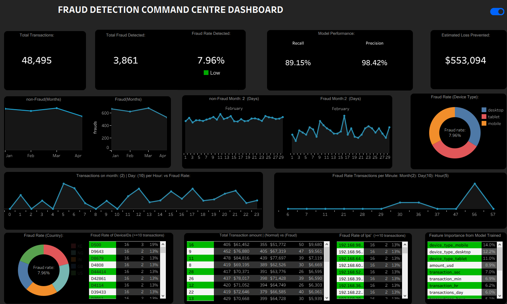

# Fraud Detection System with Behavioral Analytics

## 1. Project Overview
This project presents an end-to-end fraud detection system designed to identify suspicious transaction behavior using machine learning and behavioral analytics.

The solution focuses on detecting fraud patterns through transaction activity, device usage, and temporal signals, and translates these insights into an interactive dashboard for monitoring and decision support.

---

## 2. Business Problem
Fraud detection systems must identify abnormal transaction patterns in large volumes of data while minimizing false alerts.

Traditional rule-based approaches often fail to capture evolving fraud behavior. This project addresses that gap by leveraging data-driven methods to detect fraud based on behavioral patterns.

---

## 3. Objectives
- Detect fraudulent transactions using machine learning  
- Engineer features that capture behavioral patterns  
- Handle class imbalance effectively  
- Provide interpretable insights through visualization  
- Support decision-making with a monitoring dashboard  

---

## 4. Dataset Description
The dataset consists of:
- Transaction data  
- Device-level information  
- IP-level activity  

These datasets were integrated to create a unified analytical dataset used for modeling and analysis.

---

## 5. Methodology

### 5.1 Data Preparation
- Merged multiple datasets into a single table  
- Handled missing values and inconsistencies  
- Extracted time-based features from timestamps  

### 5.2 Feature Engineering
Key features developed include:
- Transaction velocity (per minute, hour, day, week, month)  
- Device transaction frequency  
- IP transaction activity  
- Temporal features (hour, day, week, month)  
- Encoded device types  

### 5.3 Handling Class Imbalance
- Applied SMOTE to improve fraud class representation  

### 5.4 Model Development
Models trained and evaluated:
- Logistic Regression  
- Random Forest Classifier  
- XGBoost Classifier  

---

## 6. Model Performance

Model | Recall | Precision | F1 Score | Accuracy
----- | ------ | --------- | -------- | --------
Random Forest | 0.89 | 0.98 | 0.93 | 0.94
XGBoost | 0.83 | 0.97 | 0.90 | 0.91
Logistic Regression | 0.61 | 0.98 | 0.75 | 0.80

The Random Forest model achieved the best balance between detecting fraud and minimizing false positives.

---

## 7. Dashboard
An interactive dashboard was developed using Tableau to support fraud monitoring.

Key features include:
- Fraud trends over time  
- Device and IP risk analysis  
- Transaction behavior insights  
- Model performance tracking  
- Estimated financial loss prevented  

---

## 8. Key Insights
- Fraudulent transactions often occur in high-frequency bursts  
- Repeated device and IP usage is a strong fraud indicator  
- Temporal patterns significantly influence fraud detection  
- Behavioral features significantly improve model performance  

---

## 9. Challenges
- Incomplete fraud labels required alternative labeling strategies  
- Severe class imbalance affected early model performance  
- Feature engineering required multiple iterations to identify meaningful patterns  

---

## 10. Conclusion
This project demonstrates how combining behavioral feature engineering with machine learning can improve fraud detection systems.

It also highlights the importance of making analytical solutions interpretable and actionable through dashboards.

---

## Project Structure

```
/Customer-Segmentation and churn Prediction
│
├── README.md
├── fraud-dashboard.png
├── /data
├── /notebooks
└── /dashboard
```
## Dashboard Preview


